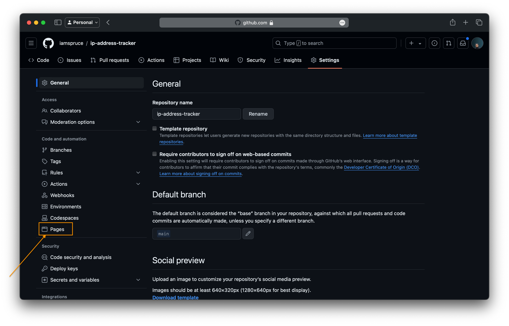
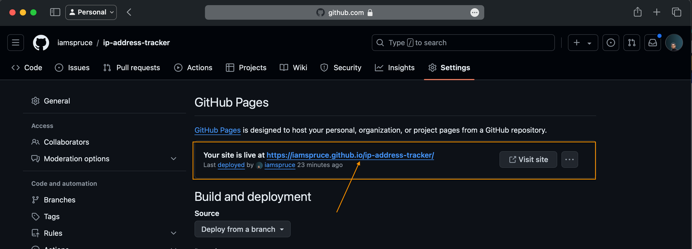

# How to Enable GitHub Pages

- Go to your GitHub repository in a web browser.
- Click on the "Settings" tab.
- Scroll down to the "Pages" section in the left-hand menu.
- Under "Source," select the branch you want to publish from (typically main or master), and choose the root folder.

- Selecting the branch and root folder for GitHub Pages.
- Click "Save."
- After enabling GitHub Pages, GitHub will provide you with a URL where your site is published. It usually follows this format: https://<username>.github.io/<repository-name>

- Open your browser and paste the URL to see your live website.

[Source](https://www.freecodecamp.org/news/host-your-first-project-on-github/#heading-how-to-configure-git)